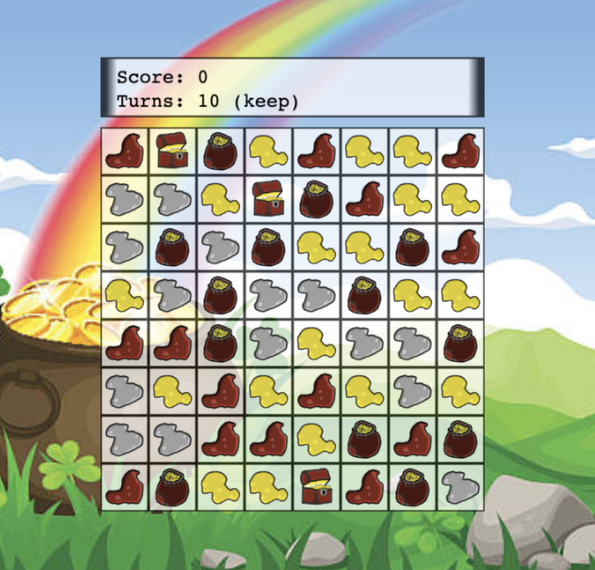

# Leprechaun

Leprechaun is a game based on [Gems of War](https://gemsofwar.com/), the [Threasure Hunt](https://gemsofwar.zendesk.com/hc/en-us/articles/205368765-Treasure-Hunt-and-Treasure-Maps).

The base of the game is swap pieces, only one each time and only with the ones in north, south, east or west of the source one. The combinations should be made by 3 or more in vertical or horizontal way. If you achieve to match 4 then you won't loose a turn and if you achieve match more than 4 then you'll obtain an extra turn. The game starts with 10 turns and ends when you run out of turns.

If you love this content and want we can generate more, you can support us:

[](https://www.paypal.com/cgi-bin/webscr?cmd=_s-xclick&hosted_button_id=CBYJ5V2ZWWZ8G)

## Installation

It's easy to install. You only needs to have [Elixir](https://elixir-lang.org/install.html) installed and run this to obtain the code:

```
git clone git@github.com:altenwald/leprechaun.git
```

Then you can see there are a new directory in that path called `leprechaun`. You can go inside using the terminal and write:

```
iex -S mix run
```

The Elixir shell will be running after the compilation. You can start the game using this command:

```elixir
Leprechaun.Game.run :mygame
```

Follow the instructions and enjoy!

### Web Interface

Version 0.2.0 has a new addition and it's [cowboy][1] and [jason][2] among others to provide an HTTP
interface to let us to play via web as you can see in the picture:

[](screenshot_web.png)

You only need to run the project as showed above (in the previous section) and then access via this link:

http://localhost:1234

You can change the configuration to listen in another port and even to use IPv6 instead.

Enjoy!

[1]: https://github.com/ninenines/cowboy
[2]: https://github.com/michalmuskala/jason
